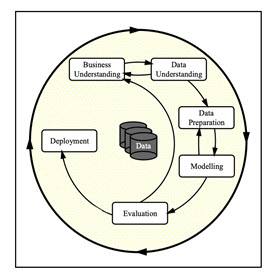

<h1 style="text-align: center; color: Purple;">Marketing over the telephone - Will clients subscribe/buy bank products?</h1>

This Python application using Jupyter Notebook explores a dataset containing information of approximately 42,000 records in order to determine which factors make a potential client subscribe to bank products.

<a href="https://github.com/Balu-A/*.ipynb" target="_blank">Jupiter Notebook used</a>

 The current CRISP-DM Process Model for Data Mining (see Figure 1) was followed.

<h4 align="center"> Figure 1</h4>

<h2>Business Understanding</h2>
From a business perspective, we are tasked with identifying key drivers for used car prices.  In the CRISP-DM overview, we are asked to convert this business framing to a data problem definition.  Using a few sentences, reframe the task as a data task with the appropriate technical vocabulary. 

<ol style="font-family: Arial;font-size: 16px;">
    <li style="color:Blue">  Tasks Involved: </li>
    <ul>
        <li style="color:Blue"> Develop a predictive modeling framework to determine whether a client will subscribe to a term deposit based on various demographic, social, economic, and contact-related features.</li>
        <li style="color:Blue"> Perform exploratory data analysis to identify potential predictors of user subscription, such as Age, Marital Status, Contact Frequency, Loan Payments etc.,</li>
        <li style="color:Blue"> Construct a classification model that can quantify the impact of these features on the user subscription. Key tasks include feature selection, model training, and validation to ensure the model accurately captures the relationship between user attributes and their importance.</li>
        <li style="color:Blue"> Pinpoint the most influential factors affecting user subscription and provide actionable insights for marketing strategies.</li>
    </ul>
</ol>

<h2>Data Understanding</h2>
After considering the business understanding, we want to get familiar with our data.  Write down some steps that you would take to get to know the dataset and identify any quality issues within.  Take time to get to know the dataset and explore what information it contains and how this could be used to inform your business understanding.

 
<ol style="font-family: Arial;font-size: 16px;">
    <li style="color:Blue">  Data Exploration: </li>
    <ul>
        <li style="color:Blue"> Begin by examining the structure of the dataset. How many columns and rows does it contain?</li>
        <li style="color:Blue"> Print out the first few rows of the dataset to get a sense of what the data looks like.</li>
        <li style="color:Blue"> Check the data types of each column. Are they numerical, categorical, or date-time?</li>
        <li style="color:Blue"> Look for any missing values in the dataset. How prevalent are they, and how might they affect your analysis?</li>
    </ul>
    <li style="color:Blue">  Column Analysis: </li>
    <ul>
        <li style="color:Blue"> Examine the unique values in categorical columns. Are there any unexpected or invalid values?</li>
        <li style="color:Blue"> For numerical columns, check for outliers. Are there any values that seem unreasonable or far from the central tendency of the data?</li>
        <li style="color:Blue"> Check for consistency in date-time columns. Are all dates formatted correctly, and do they fall within expected ranges?</li>
    </ul>
    <li style="color:Blue">  Data Quality Assessment: </li>
    <ul>
        <li style="color:Blue"> Assess the completeness of the dataset. Are there any columns with a high proportion of missing values?</li>
        <li style="color:Blue"> Look for duplicates in the dataset. Are there any rows that are exact duplicates or nearly identical duplicates?</li>
    </ul>
    <li style="color:Blue">  Visualization: </li>
    <ul>
        <li style="color:Blue"> Create visualizations such as histograms, box plots, or scatter plots to explore the relationships between variables and identify any patterns or trends.</li>
        <li style="color:Blue"> Visualize missing data patterns to understand if there are any systematic issues with missing values.</li> 
    </ul> 

<h2>Data Preparation</h2>

1. A quick examination using DF.INFO yielded 
results that show that there is NO null data  across features. 
 

<h4 align="center"> Figure 2</h4>

2. Nulls per column:

<h4 align="center"> Figure 3</h4>

3. Upon inspection, there were **12 duplicate rows** in the 
dataframe which were dropped.

4. For better readability, I have renamed the original feature names to something more easier to read

5. Next up, all the **categorical** features were encoded using 'Target encoding' technique.
A correlation heatmap was developed to understand the strength between dependent
and independent variables.

<h4 align="center"> Figure 5</h4>

6. In order to build effective models, after performing feature selection using 
Sequential Feature Selection some of the low-importance features were **dropped** from the dataframe. The top 7 selected features are:

['Age', 'Number of Contacts During Campaign',
       'Days Since Previous Contact', 'Consumer Price Index', 'Marital Status', 'Housing Loan', 'Personal Loan']

<h2>Data Modeling </h2>

The prediction of output was made using various
set of independent variables/input variables using various classification models. The models used were: 

  
<strong>(a) Logistic Regression</strong>   
<strong>(b) Support Vector Machine</strong>   
<strong>(c) K-Nearest Neighbors</strong>  
<strong>(d) Decision Trees</strong>

Out of the 4 models, the Logistic regression model performed relatively better with 89% of test accuracy and train time. 
SVM can achieve high accuracy, especially with the right kernel, but has a slow training time. All models have achieved around 89% test accuracy, so the choice depends on 
the trade-off between training time and model complexity 

<h4 align="center"> Figure 7</h4>

<h2>Findings</h2>

(a) The<strong> most important drivers</strong> depicted by Sequential Feature Selector are: 

1. Age   2.Number of Contacts During Campaign   3. Days Since Previous Contact   4.Consumer Price Index  
5.Marital Status   6. Housing Loan   7.Personal Loan

  

<h4 align="center"> Figure 8</h4>

(a) Age of the customer is correlated with their subscription. In essence, customers in the age group of 55-75 are less likely to subscribe. 
(b) Customers most recently contacted within 3-6 days largely accepted the subscription. 
(c) Customers with housing loans are more likely to buy products and subscriptions. 

<h4 align="center"> Figure 9</h4>

(e) Subscribers do not tend to have a personal loan taken out, while non-subscribers are more likely to have either an unknown or positive loan status.  
(f) Subscribers tend to be married or single, while divorced individuals are not likely to subscribe.  
<nobr>

<h2>Next Steps and Recommendations</h2>

- There is a high likelihood of clients within the age group of 25-50 to subscribe. Therefore, marketing should target this section. 
- Clients that have not been previously contacted do not tend to subscribe, while the majority of subscribing clients have been previously  
contacted 3-6 times, so multiple (at least 3, aim for 6) calls made to the same individual is highly recommended. 
- An overwhelming majority of divorced clients turned down the subscription offer, so avoid targeting divorced individuals. Marketing should instead  
prioritize clients that are married or single. 
- Unsubscribers have a higher proportion of individuals with a personal loan, while clients without a personal loan have a higher proportion of  
subscribers. As a result, marketing should focus on targetting individuals who do not have a personal loan. 
- There is a higher percentage of subscribers that have housing loan. Therefore, marketing should target customers with housing loans. 
